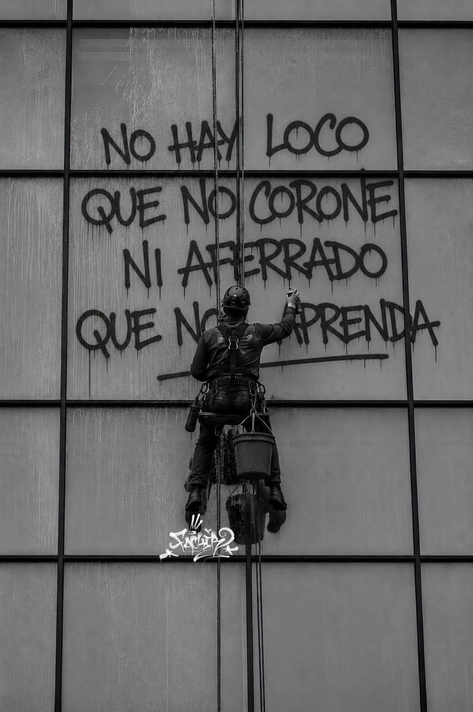
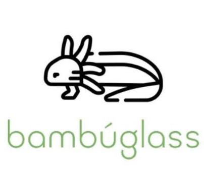
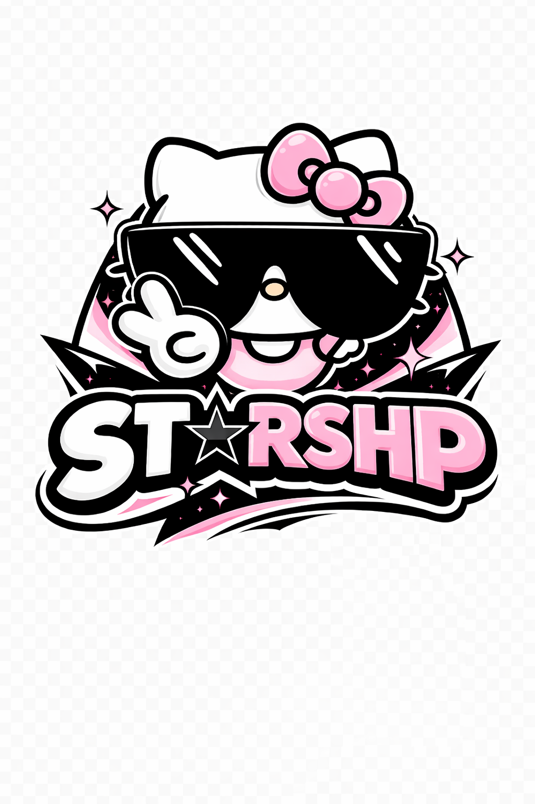
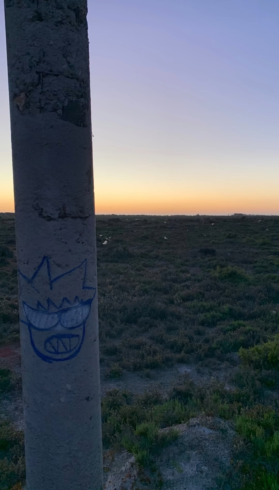
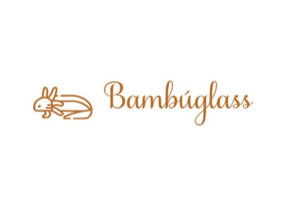
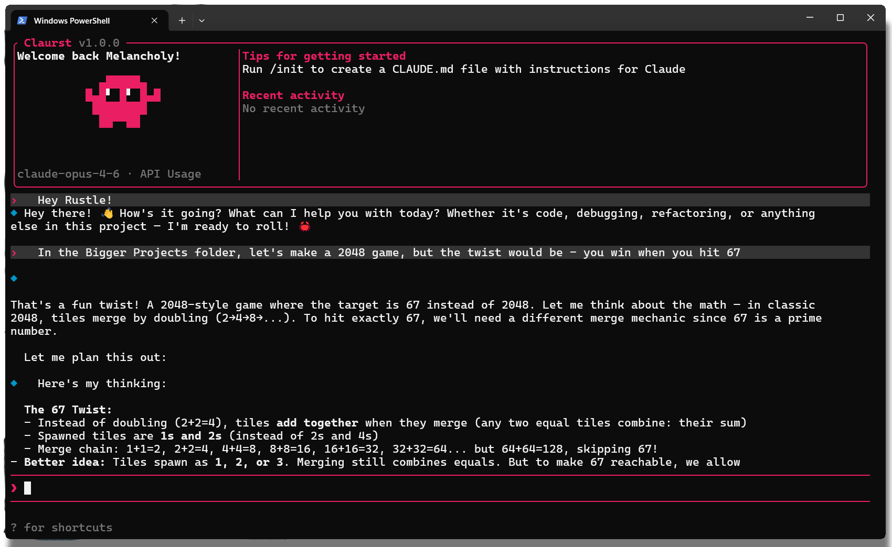
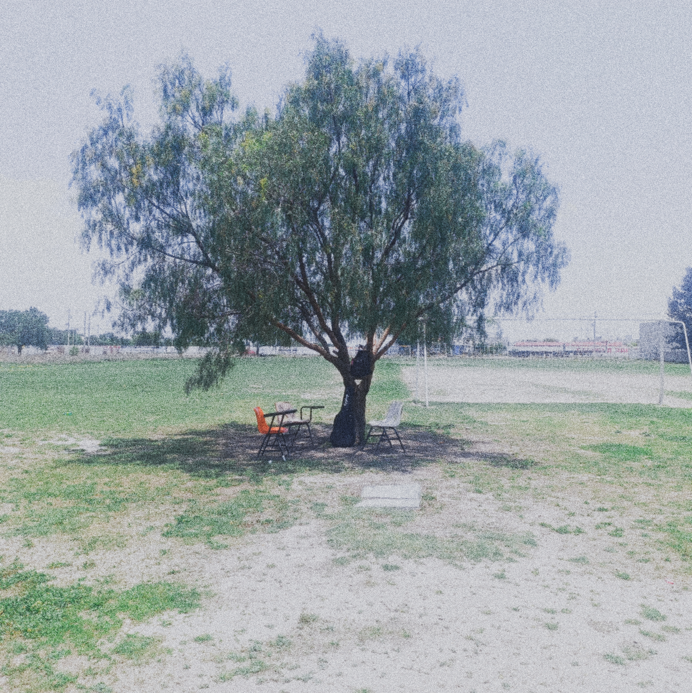
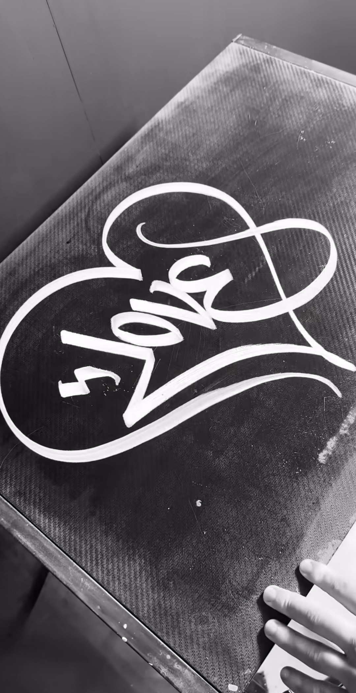

# Equalizer_python
Un ecualizador/lyric de Python con la canción "la magia de litlle Jesús"

 
 

# 🚀 STARSHP PROJECTS
### Portafolio de Proyectos y Sistemas

 

---

# 📋 Tabla de Contenidos

- Sobre el Proyecto
- Repositorios
- Tecnologías
- Capturas
- Sobre el Autor
- Contacto
- Licencia

---

# 📖 Sobre el Proyecto

Colección de proyectos enfocados en desarrollo web, automatización, inteligencia artificial, sistemas de escritorio y herramientas orientadas a soluciones digitales.

Los repositorios incluidos abarcan tecnologías modernas utilizadas tanto en entornos educativos como en proyectos funcionales y sistemas automatizados.

---

# 📦 Repositorios

---

## 🌐 BAMBUGLASS

 

### 📖 Descripción

Sistema web orientado a gestión digital y automatización de procesos mediante tecnologías web modernas, bases de datos y herramientas backend.

---

## 🤖 BOT

 

### 📖 Descripción

Sistema compuesto por múltiples bots de Telegram desarrollados en Python para automatización de tareas, comandos y funciones integradas.

---

## 🧠 NANO IA CHROME

 

### 📖 Descripción

Sistema local de automatización e integración con inteligencia artificial ejecutado mediante herramientas basadas en Chrome y automatización avanzada.

---

## 🪟 BOTONES

 

### 📖 Descripción

Proyecto desarrollado en Windows Forms utilizando C# con funcionalidades interactivas orientadas a manipulación dinámica de texto mediante botones.

---

## 🍽️ B DE RUBÉN

 

### 📖 Descripción

Sistema desarrollado en Java para gestión de menú y almacenamiento de información mediante archivos CSV orientado al restaurante Rosa Negra.

---

# 🧠 Tecnologías Utilizadas

---

# 📸 Capturas

| Proyecto | Vista |
|----------|--------|
| BAMBUGLASS |  |
| BOT |  |
| NANO IA CHROME |  |
| BOTONES |  |
| B DE RUBÉN |  |

---

# 👤 Sobre el Autor

### `starshp`
### Desarrollador de Software | Web · Backend · Sistemas

---

Hola, soy starshp — programador apasionado por construir soluciones reales a través del código. Me especializo en desarrollo web, automatización y sistemas, con experiencia tanto en entornos escolares como laborales.

Trabajo principalmente en proyectos orientados a negocios: sitios web, aplicaciones web, bots de automatización y sistemas con bases de datos. Me gusta mantener código limpio, proyectos bien documentados y soluciones que realmente funcionen.

---

# 🔗 Contacto

---

# 📄 Licencia

Este proyecto está bajo la licencia MIT.  
Consulta el archivo LICENSE para más detalles.

---

Desarrollado con 💻 por starshp

